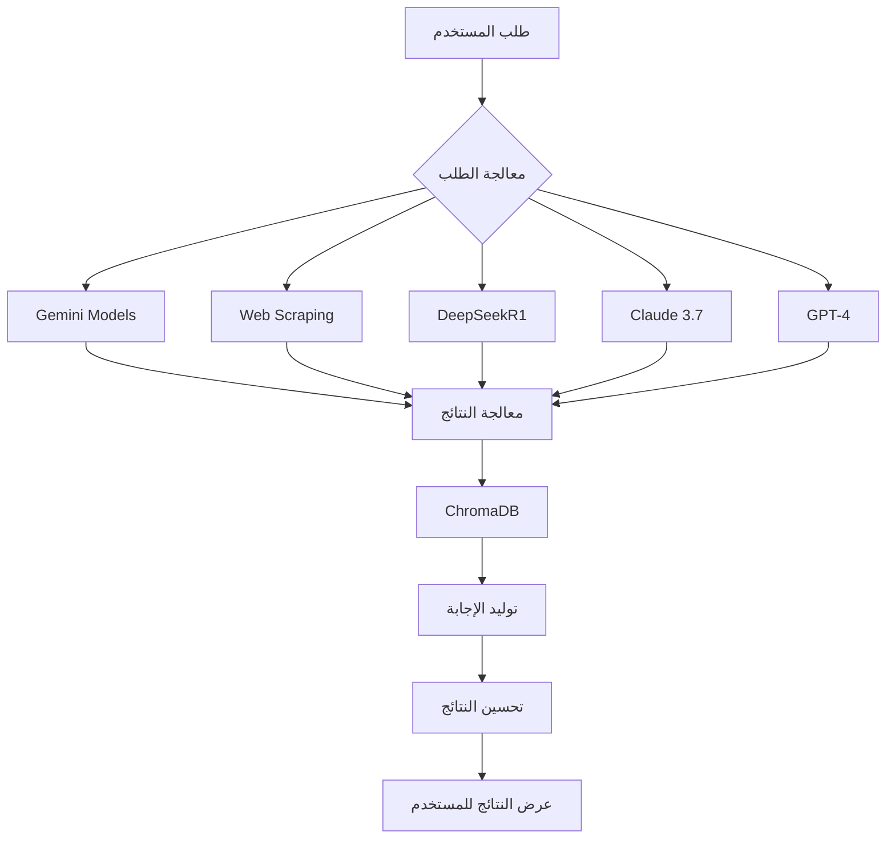

# خطة مشروع Horus AI Pipeline

## الميزانية والجدول الزمني

### توزيع الميزانية ($1300)
| الشهر | المبلغ | الأنشطة الرئيسية |
|--------|---------|-------------------|
| الشهر 1 | $500 | - إعداد البنية التحتية على Google Cloud
        | | - تجربة واختبار النماذج الأولية
        | | - تكامل خدمات Vertex AI |
| الشهر 2 | $400 | - تحسين النماذج وتطوير RAG
        | | - دمج نظام Web Scraping
        | | - تحسين الأداء والذاكرة |
| الشهر 3 | $400 | - اختبار الأداء والموثوقية
        | | - تحسين جودة النتائج
        | | - إعداد نظام المراقبة |

## نظرة عامة على النماذج

يهدف مشروع Horus AI Pipeline إلى دمج مجموعة متنوعة من نماذج الذكاء الاصطناعي لتغطية مختلف مهام معالجة وتحليل البيانات. تم اختيار النماذج التالية:

- **Gemini 1.5 Flash** و **Gemini 2.5 Flash**: المعالجة العامة وتوليد الاستجابات
- **DeepSeekR1**: التحليل الرياضي والمنطقي
- **Claude 3.7 Sonnet**: تحليل القضايا الفلسفية والأخلاقية
- **GPT-4**: توليد المحتوى الإبداعي والتفاعلي

## توزيع المهام بين النماذج

| المهمة | النموذج المسؤول | مثال استخدام |
|---------|-----------------|----------------|
| **البحث الأولي** | Gemini 1.5 Flash | البحث وتلخيص المصادر |
| **التحليل المنطقي** | DeepSeekR1 | تحليل البيانات رياضياً ومنطقياً |
| **التحليل الفلسفي** | Claude 3.7 Sonnet | مناقشة الآثار الأخلاقية |
| **التوليد الإبداعي** | GPT-4 | كتابة محتوى إبداعي |
| **التخزين الذكي** | ChromaDB/Vertex Matching Engine | تخزين واسترجاع البيانات |
| **استرجاع السياق** | نظام RAG مع Vertex AI | استرجاع المعلومات السياقية |

## آلية العمل

## القدرات الرئيسية للنماذج

### Gemini 1.5/2.5 Flash
- معالجة النصوص بالعربية والإنجليزية
- تحليل المحتوى وفهم السياق
- توليد إجابات دقيقة ومتناسقة

### DeepSeekR1
- تحليل البيانات والأرقام
- تفسير النتائج الرياضية والمنطقية
- تقديم شروح تقنية مفصلة

### Claude 3.7 Sonnet
- التعامل مع المحادثات العميقة
- تقديم رؤى فلسفية متعددة
- دعم التحليل الأخلاقي

### GPT-4
- توليد نصوص إبداعية ومتعمقة
- التعامل مع مهام الكتابة بمرونة
- دعم التفاعل الديناميكي

## خطة التطوير المستقبلية

1. **تحسين النماذج**
   - تجربة نماذج مختلفة من Google Cloud
   - تحسين دقة النتائج
   - تطوير نظام التعلم المستمر

2. **توسيع القدرات**
   - إضافة دعم للغات إضافية
   - تحسين قدرات Web Scraping
   - تطوير واجهات API إضافية

3. **تحسين الأداء**
   - تحسين زمن الاستجابة
   - تقليل استهلاك الموارد
   - تحسين نظام الذاكرة والسياق

